# Operating the Prüfstand

How to use the Digifant-2 test bench: what it does, how to drive it from the
buttons and display or from a PC, how to read what it measures, and which
safety behaviour to expect. Written for technically minded users who know
their way around an engine ECU but haven't seen this bench before.

- Setting the board up for the first time: [`../BRINGUP.md`](../BRINGUP.md)
- Firmware internals, full protocol reference, tests: [`README.md`](README.md)
- Hardware design and pinouts: [`../DESIGN.md`](../DESIGN.md)

All screen images below are rendered from the firmware's own display code
(see [Regenerating the images](#regenerating-the-images)), so they show
exactly what the OLED shows. The readings in them are example values.

## What the bench does

The bench stands in for the engine around a real Digifant-2 ECU (VW 2H
engine). It generates the signals the ECU expects and measures what the ECU
sends back:

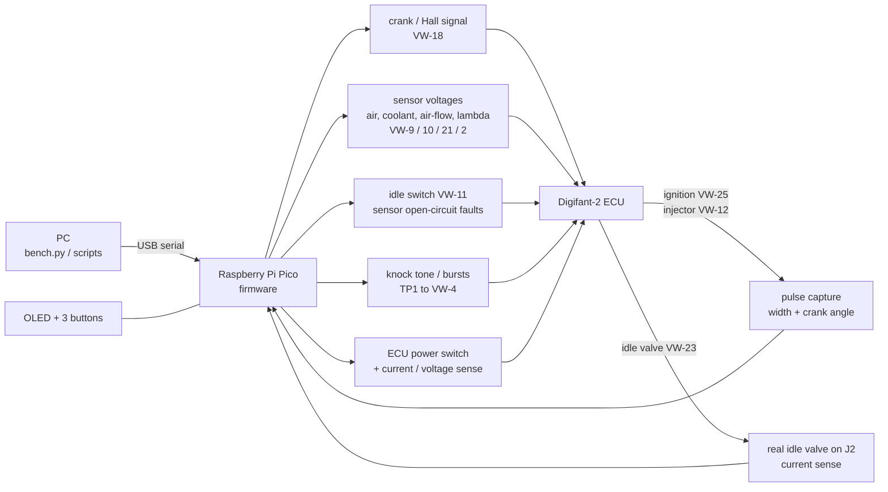

| Simulated for the ECU | Range |
|---|---|
| Engine speed (Hall signal on VW-18, 0 / 12 V square wave) | 0–8000 rpm, pulses per rev and duty adjustable |
| Intake-air and coolant temperature (NTC inputs VW-9, VW-10) | 0–3300 mV each, or open circuit (sensor fault) |
| Air-flow meter wiper (VW-21) | 0–3300 mV |
| Lambda / O₂ sensor (VW-2) | 0–2047 mV in 0.5 mV steps, or open circuit |
| Idle switch (VW-11) | closed / open |
| Knock sensor (TP1/TP2 to VW-4/VW-5) | 1–20000 Hz sine, continuous or in crank-synchronised bursts |
| ECU supply (VW-14) | switched on/off by the bench |

| Measured from the ECU | Resolution |
|---|---|
| Ignition output (VW-25): pulse width, period, crank angle of both edges | 1 µs, ~0.1° |
| Injector output (VW-12): open time, period, crank angle | 1 µs, ~0.1° |
| ECU current and supply voltage | 0.125 mA, 1.25 mV |
| Idle-valve current and supply voltage (valve on J2, driven by the ECU) | 0.08 mA, 1.25 mV |
| Air-flow meter reference voltage from the ECU (VW-17) | 2.4 mV |

## Connections

| Where | What |
|---|---|
| **USB** (on the Pico) | Power for all the logic, and the PC connection. Without USB the bench is off and the ECU unpowered. |
| **J1** | 12 V bench supply (use one with a current limit). Feeds the ECU and the crank signal pull-up. |
| **J0** | Screw terminals to the ECU harness, labelled by VW pin; `+12V SW` = switched ECU supply, `GND` = ground. |
| **J2** | The real idle-air-control valve (the ECU drives it through VW-23). |
| **TP1 / TP2** | Knock output / ground, wired to the ECU's VW-4 / VW-5 by a short pigtail. |
| **J3** | I²C OLED, pin order `GND / 3V3 / SCL / SDA` (check your module!). |
| **SW1 / SW2 / SW3** | MENU / − / + buttons. |

## Power-up and safe state

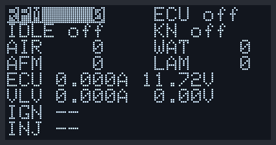

After plugging in USB the bench always starts in a safe state, whatever it
was doing before:

- ECU **off** (and it stays off until you switch it on)
- crank stopped (the crank signal's pull-up is on the switched ECU rail, so
  VW-18 only reads 12 V once the ECU is on)
- all sensor DACs at 0 mV, all three sensors connected, idle switch open
- knock generator off

The screen above is the power-up state with 12 V connected but no ECU
switched on: the ECU supply reads 11.72 V (the always-live side of the power
switch), and the valve supply reads 0 V because the switched rail is off.
`IGN --` and `INJ --` mean no pulses in the last 2 seconds.

## The display

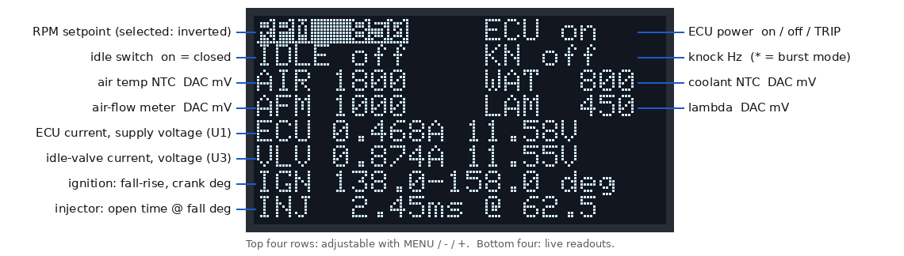

The screen refreshes every 200 ms and immediately after a button press. The
**top four rows** are settings, adjustable with the buttons; the selected one
is drawn inverted. The **bottom four rows** are live readings:

| Row | Shows |
|---|---|
| `ECU 0.468A 11.58V` | Total current into the ECU rail and the supply voltage ahead of the ECU switch. |
| `VLV 0.874A 11.55V` | Idle-valve current (PWM from the ECU, averaged) and the switched supply. `--` if that monitor doesn't answer. |
| `IGN 138.0-158.0 deg` | Ignition output: crank angle of the pulse's start and end, measured from the crank reference (see [Crank angles](#crank-angles-and-bursts)). With the crank stopped: `IGN low 3920 us`, the width of the last pulse. |
| `INJ 2.45ms @ 62.5` | Injector open time, and the crank angle at which it opened. |

## Using the buttons

**MENU** steps to the next setting: RPM → ECU → IDLE → KN → AIR → WAT → AFM →
LAM → back to RPM. **−** and **+** change the selected setting.

| Setting | − / + | Held down |
|---|---|---|
| `RPM` | −/+ 50 rpm, 0–8000 | repeats (after 0.4 s, then every 0.1 s) |
| `ECU` | − off, + on (never toggles, so a double press can't switch it) | no repeat |
| `IDLE` | − open, + closed (throttle at idle) | no repeat |
| `KN` | −/+ 500 Hz knock tone, below 500 = off | repeats |
| `AIR`, `WAT`, `AFM`, `LAM` | −/+ 50 mV on that sensor output | repeats |

Buttons and PC commands change the same settings, so you can mix them freely:
the display always shows the current state, including changes made over USB.

### Example: switching the ECU on

Press **MENU** once: `ECU off` is selected.

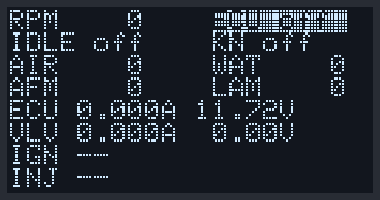

Press **+**: the ECU is powered. Its current appears in the `ECU` row
(here 0.41 A) and the switched rail comes up in the `VLV` row.

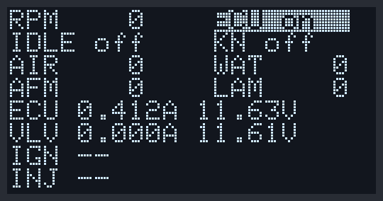

While the ECU is off, the sensor voltages and the knock tone are held at 0 V
("parked") so they can't feed current into an unpowered ECU. Your settings are
kept and applied the moment the ECU is switched on.

### Example: a warm idle at 850 rpm

With the sensors set for a warm engine (coolant `WAT 800`, air `AIR 1800`,
air-flow `AFM 1000`, lambda `LAM 450`), select **RPM** and press **+** 17
times (or hold it). The ECU sees an engine turning at 850 rpm and starts
firing: the `IGN` and `INJ` rows now show pulse timing and crank angles.

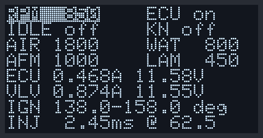

How millivolts map to temperatures depends on the ECU's input circuit and is
still to be calibrated on the real bench ([`BRINGUP.md`](../BRINGUP.md),
stage 6).

### Example: simulating a cold engine

Select **WAT** and raise the coolant sensor voltage (here to 3000 mV; a
higher NTC voltage means colder). The ECU should respond with longer injector
pulses and a different idle-valve current.

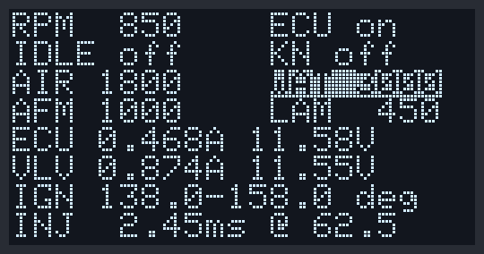

### Knock

**KN** sets the knock tone frequency. A `*` after it means burst mode is on
(bursts are set up from the PC, see below): the tone then only sounds in a
crank-angle window after every reference instead of continuously.

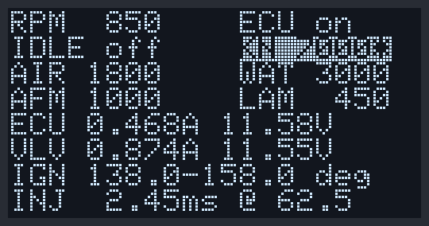

### Over-current trip

If the ECU draws more than the trip current (default 2.5 A) for two readings
in a row (~0.3 s), the bench switches the ECU off by itself and the display
shows `ECU TRIP`. The ECU can't be switched back on until the trip is
acknowledged.

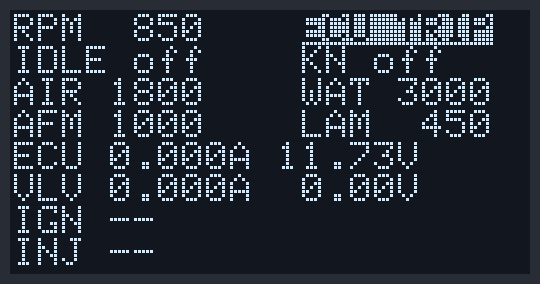

To recover: find the cause, then select **ECU** and press **−** once to
acknowledge (`ECU off`), then **+** to switch on again. From the PC:
`ecu reset`, then `ecu on`.

### Crank stopped

With the crank stopped (`RPM 0`) there is no reference to measure angles
from, so the rows show the width of the last pulse instead: here the
ignition output was last low for 3.92 ms and the injector last open for
6.10 ms. Both change to `--` two seconds after the last pulse. `VLV --`
means the valve current monitor isn't answering.

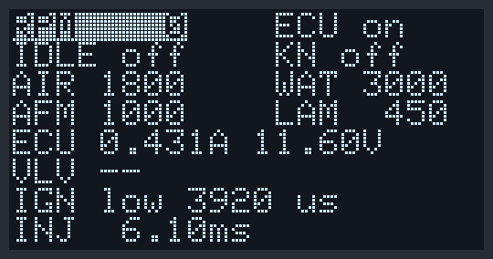

## Controlling the bench from a PC

The Pico appears as a USB serial port. `host/bench.py` finds it
automatically (`pip install pyserial` first):

```sh
python3 host/bench.py                       # interactive prompt
python3 host/bench.py "ecu on" "rpm 850" capture
```

```text
bench> ecu on
OK ecu=on
bench> rpm 850
OK rpm=850
bench> capture
OK ign_n=512 ign_glitch=0 ign_period_us=35294 ign_low_us=3920 ign_fall_deg=138.0 ign_rise_deg=158.0 inj_n=256 inj_glitch=0 inj_period_us=70588 inj_low_us=2450 inj_fall_deg=62.5 inj_rise_deg=75.0
```

Every command gets exactly one line back, `OK` with `key=value` fields or
`ERR` with a reason. Commands are case-insensitive, numbers are plain
decimal. The most used ones:

| Command | Does |
|---|---|
| `status` | All settings in one line. |
| `read` | ECU and valve current/voltage, VW-17 reference. |
| `capture` | Ignition and injector pulse timing and angles. |
| `ecu on` / `ecu off` / `ecu reset` / `ecu trip <mA>` | ECU power, trip acknowledge, trip current (100–4000 mA). |
| `rpm <0..8000>` | Engine speed; 0 stops the crank signal. |
| `crank ppr <n>` / `crank duty <pct>` | Hall pulses per crank revolution (default 2) and % high (default 50). |
| `dac air\|water\|afm\|lambda <mV>` | Sensor voltages. |
| `sensor air\|water\|lambda open\|conn` | Simulate a broken sensor wire, and reconnect it. |
| `idle on\|off` | Idle switch. |
| `knock <Hz>` / `knock off` | Knock tone. |
| `burst <start_deg> <len_deg> [every]` / `burst off` | Knock in bursts: from `start_deg` after each reference, for `len_deg`, on every Nth reference. |

The full list with every field is in the [protocol reference](README.md#protocol).

### Scripting

`bench.py` is also a Python module. `Bench.cmd()` returns the reply's fields
as a dict and raises `BenchError` on `ERR`:

```python
from bench import Bench

with Bench() as b:
    b.cmd("ecu on")
    b.cmd("dac water 800")
    b.cmd("rpm 850")
    print(b.cmd("capture")["ign_rise_deg"])
```

[`host/examples/rpm_sweep.py`](../host/examples/rpm_sweep.py) is a complete
example: it sets a warm idle, steps the engine speed from 850 to 4000 rpm and
writes the ignition angles, dwell, injector time and ECU current at each step
to a CSV file, ready for plotting an advance curve:

```sh
python3 host/examples/rpm_sweep.py --out sweep.csv
```

Leave each step a moment to settle (`--settle`, default 1.5 s): the ECU needs
a few revolutions to react, and the current readings are averaged over
~0.14 s.

## Crank angles and bursts

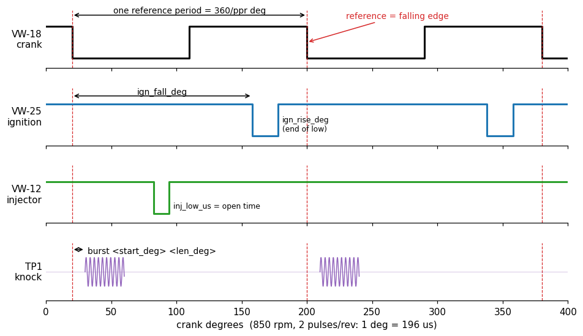

Everything angle-related is measured from the **crank reference**: the
falling edge of the Hall signal on VW-18 (dashed red lines). With the default
2 pulses per crank revolution, one reference period is 180 crank degrees.

- Angles are computed from the *measured* time since the last reference and
  the *measured* reference period, so they stay correct while rpm changes.
- `ign_fall_deg` / `ign_rise_deg`: where the ignition output's low phase
  starts and ends. A pulse that runs past the next reference is still
  measured from the one before it (e.g. 170° → 200°, not 170° → 20°).
- `inj_fall_deg`: where the injector opens; `inj_low_us` is its open time.
- `burst 10 30` sounds the knock tone from 10° to 40° after every reference;
  `burst 10 30 2` on every second reference only (at 2 pulses/rev: once per
  crank revolution, like one knocking cylinder). A burst must fit inside one
  reference period (start + length < 360 / ppr).

Timing resolution is 1 µs: at 850 rpm one crank degree is 196 µs, at 6000 rpm
it's 28 µs.

## Safety behaviour

| Situation | What the bench does |
|---|---|
| USB plugged in / Pico reset | Safe state: ECU off, crank stopped, sensors at 0 mV, knock off. |
| USB unplugged | Everything off; a pull-down on the power switch keeps the ECU unpowered. |
| ECU off | Sensor voltages and knock tone parked at 0 V, settings kept. |
| ECU current above the trip level for ~0.3 s | ECU switched off, fault latched until `ecu reset` or − on ECU. |
| Firmware hangs | Watchdog resets the Pico after 2 s → safe state; `status` shows `boot=watchdog`. |
| Sensor DAC not answering | Writes are retried every second; `status` shows `dac_i2c=err` until it's back. |

The over-current trip reacts in ~0.3 s; short spikes are left to the board's
3 A fuse.

## Known limits and open assumptions

These are documented in detail in [`README.md`](README.md) and are to be
settled on the real bench ([`BRINGUP.md`](../BRINGUP.md), stage 6):

- **Hall waveform:** 2 pulses per crank revolution and 50 % duty are
  assumptions until measured on a real engine (`crank ppr`, `crank duty`).
- **Reference and spark edge:** the firmware measures from the VW-18 falling
  edge; which ignition edge is the spark (probably the end of the low phase)
  is still to be confirmed.
- **Sensor voltages are set at the DAC**, ahead of a 220 Ω (lambda 1 kΩ)
  series resistor; if the ECU has an internal pull-up on its NTC inputs, the
  voltage it sees is higher than the setting.
- **Knock amplitude is fixed** and falls with frequency (about 75 % at 7 kHz
  of the 1 kHz level).
- **Display:** assumes an SSD1306 OLED; SH1106-based 1.3″ modules need a
  driver change.
- The status LED has no firmware yet.
- No firmware has run on real hardware yet (September 2026).

## Regenerating the images

The screens are rendered on a PC by
[`docs/render_screens.c`](docs/render_screens.c), which drives the real
display code (`src/ui_core.c`, `src/gfx.c`) through the same steps as above,
then styled and annotated by [`docs/make_images.py`](docs/make_images.py):

```sh
firmware/docs/make_images.sh      # needs gcc, python3, Pillow, matplotlib
```

CI builds and runs the renderer on every push, so a change to the display
code that breaks it is caught; re-run the script to update the pictures.
