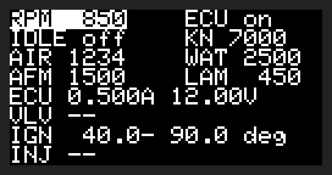

# Pruefstand firmware (Raspberry Pi Pico 2, Pico SDK / C)

USB serial command protocol plus the hardware blocks behind it. **To use the
bench, start with [`OPERATION.md`](OPERATION.md)** (display, buttons, PC
control, how to read the measurements); this file is the developer reference. The PC side
(`../host/bench.py`) and later Claude Code drive the bench through this.
Milestones so far: 1 skeleton and protocol, 2 crank signal, 3 sensor DAC,
4 current/voltage sensing, 5 knock generator, 6 ignition/injector capture,
7 crank-synchronised knock bursts, 8 OLED and button menu, 0.9 review fixes
(ECU over-current trip, output parking, watchdog, capture/burst timing).
Every hardware block on the board now has a real driver.

## Build and flash

```sh
git clone --depth 1 --branch 2.1.1 https://github.com/raspberrypi/pico-sdk.git ~/pico-sdk
(cd ~/pico-sdk && git submodule update --init --depth 1 lib/tinyusb)
export PICO_SDK_PATH=~/pico-sdk

cmake -S . -B build -DPICO_BOARD=pico2
make -C build -j
```

Needs `cmake` and `gcc-arm-none-eabi` (plus `libnewlib-arm-none-eabi`); the same
toolchain covers the RP2350's Cortex-M33 (`PICO_BOARD` is forced to `pico2` in
`CMakeLists.txt`, so `-DPICO_BOARD=pico` above is only for clarity, not required
-- the original Pico/RP2040 isn't supported). To flash, hold BOOTSEL while
plugging in the Pico 2 and copy `build/pruefstand.uf2` onto the `RP2350` drive.

The whole program is linked to run from RAM (`copy_to_ram`, ~60 KB of 264 KB),
so interrupt handlers never wait on flash-cache misses.

## What is real and what is a stub

| Module | State | Hardware |
|---|---|---|
| ECU power with over-current trip, idle switch, sensor disconnect | **real** | GP13 + U1, GP6, GP8/9/11 |
| VW-17 reference (`read` → `afm_ref_mv`) | **real** | GP26/ADC0, ×3 divider |
| Crank / Hall signal (`rpm`, `crank`) | **real** | GP2 → Q1, PIO0 SM0 |
| Sensor DACs (`dac`) | **real** | MCP4728 @ 0x60 |
| Current/voltage sense (`read` → `ecu_*`, `valve_*`) | **real** | INA226 @ 0x40 / 0x41 |
| Knock DDS (`knock`, `burst`) | **real**, continuous or crank-synced bursts | AD9833 on SPI0 |
| Ignition / injector capture (`capture`) | **real** | GP14 / GP15, crank reference on GP2 |
| OLED + buttons | **real** | SSD1306 @ 0x3C on J3, SW1–SW3 on GP20–22 |

Power-up state, set before any pin becomes an output: ECU **off**, idle switch
**open**, all three sensors **connected**, crank stopped (VW-18 high), DAC
outputs at 0 V. USB is the Pico's only power (VSYS/VBUS aren't wired to the
board), so unplugging it resets the bench to this state; R16 keeps the ECU off
while the Pico is unpowered.

A 2 s watchdog resets the Pico if the main loop hangs (e.g. a hard fault),
which also drops the ECU rail. `status` reports `boot=watchdog` after such a
reset, `boot=power` otherwise.

## ECU power and over-current trip

`ecu on|off` switches the ECU rail (Q2). While it's on, the main loop reads U1
every 150 ms (one new INA226 result each time); two results in a row above the
trip current switch the ECU off and latch a fault: `status` shows
`ecu_fault=overcurrent`, `ecu on` is refused, and the OLED shows `ECU TRIP`
until `ecu reset` (or − on the ECU menu item). `ecu trip <mA>` sets the limit,
100–4000 mA, default **2500 mA** (ECU ~0.6 A plus a cold idle valve ~1.8 A,
below F1's 3 A).

U1 averages over ~141 ms, so this catches a harness short or a failing ECU
within about 0.3 s, not short spikes; F1 is still the fast protection. If U1
isn't answering there is no trip (`read` then shows `ecu_a=na`).

While the ECU is off, the sensor DACs are held at 0 V and the knock generator
in reset, so they can't feed current into the unpowered ECU's inputs through
its protection diodes. Setpoints are kept (and shown by `status`) and applied
when the ECU is switched on: rail first, then the outputs; on switch-off the
outputs are parked first. So to check a DAC output with a multimeter, switch
the ECU on (with or without an ECU connected).

Signal polarities to keep in mind (see `src/pins.h`): GP2 high pulls VW-18
*low* (Q1 is an open-drain pull-down), and the ignition/injector capture inputs
(GP14/GP15) see *active-low* pulses.

## Crank / Hall signal

A PIO state machine generates the square wave on GP2 with cycle-exact timing.
Each phase length is queued in the TX FIFO and topped up from an interrupt,
so a busy main loop (e.g. USB output) can't stretch a period. Range: `rpm`
0–8000, where 0 stops the wave with VW-18 held high. The 32-bit phase counters
reach down to about 1 rpm, so cranking speeds are no problem (the RP2350's
PWM block has the same fundamental limit as the RP2040's -- an 8.4 fixed-point
clock divider over a 16-bit counter -- and can't go below ~9 Hz, which is why
it isn't used).

Waveform, adjustable at runtime:

- `crank ppr <n>`: pulses per **crank** revolution. Default **2**: a
  4-cylinder distributor Hall sender with 4 vanes, turning at half crank speed.
- `crank duty <pct>`: percent of each period VW-18 is **high**. Default **50**.

**Both defaults come from the user's own distributor HiL notes** (a 30 Hz,
50% duty square wave at 900 rpm -- exactly 2 pulses per crank rev -- named
"DIZZY_FOUR_CYLINDER"). Still worth a scope check against the real 2H sender
(see `BRINGUP.md`) before trusting it blindly; they only change the timing,
nothing else depends on them.

A new `rpm`/`ppr`/`duty` takes effect once the phases already queued in the
FIFO have played out: up to about two and a half periods (~90 ms at 850 rpm,
2 ppr).

Timing is `crank_timing.c`, plain C: period = 60 s / (rpm × ppr) in system
clock cycles, split by duty, minus the program's fixed 4-cycle overhead per
phase. `test/test_crank_timing.c` checks it against hand-computed values, and
`test/emu_crank_pio.py` runs the assembled `crank.pio` in an independent PIO
emulator to confirm the N + 4 cycles-per-phase model it relies on.

## Sensor DAC (MCP4728)

All four channels use the chip's internal 2.048 V reference, which is more
accurate than the Pico's 3V3 rail:

| Channel | Output | Gain | Step | Range |
|---|---|---|---|---|
| `air` | VOUTA → R2 220 Ω → VW-9 | ×2 | 1 mV | 0–3300 mV |
| `water` | VOUTB → R3 220 Ω → VW-10 | ×2 | 1 mV | 0–3300 mV |
| `afm` | VOUTC → R4 220 Ω → VW-21 | ×2 | 1 mV | 0–3300 mV |
| `lambda` | VOUTD → R5 1 kΩ → VW-2 | ×1 | 0.5 mV | 0–2047 mV |

At gain ×2 the chip could reach 4.096 V, but the output can't exceed its
3.3 V supply, hence the 3300 mV limit (the top few tens of mV may clip).

Every write is an MCP4728 Multi-Write (datasheet DS22187E, fig. 5-8) that
carries the reference and gain bits along with the value. The chip powers up
from its own EEPROM settings, so this way a DAC reset can't leave a channel
silently mis-scaled. EEPROM is never written. At boot all four channels are set
to 0 V. A failed write returns `ERR dac not responding on i2c` and leaves the
old setpoint; after any failure (including at boot) the firmware rewrites all
four channels once a second until the chip answers. `status` shows
`dac_i2c=ok` only while the chip holds the values shown.

At boot, before the I²C peripheral starts, SCL is clocked until SDA is released
and a STOP is sent, in case a Pico reset interrupted a transfer and left a chip
holding the bus.

**`dac` sets the DAC output pin, not the voltage the ECU measures.** There's a
series resistor between them (220 Ω, or 1 kΩ for lambda), so the two only match
if the ECU input draws no current. If the ECU's NTC inputs have an internal
pull-up to 5 V (common for temperature inputs), the voltage at VW-9/VW-10 will
sit above the setpoint. That offset needs calibrating against the real ECU
(measure the pin with the sensor switched to `open`, then again under load)
before `dac` values can be mapped to temperatures.

## Current and voltage sense (INA226)

| `read` field | Chip | Measures |
|---|---|---|
| `ecu_a` | U1 @ 0x40, RS1 0.020 Ω | total ECU current, 0.125 mA steps, up to 4.09 A |
| `ecu_v` | U1 VBUS | `+12V_ECU`, upstream of the Q2 switch (~0.1 V above VW-14) |
| `valve_a` | U3 @ 0x41, RS2 0.033 Ω | idle-valve current, 0.076 mA steps, up to 2.48 A |
| `valve_v` | U3 VBUS | `+12V_ECU_SW`, the valve feed |

Current is computed directly from the shunt-voltage register (V_shunt / R_shunt),
so the chip's calibration and current registers aren't used. U3's IN+ sits on
the ECU side of RS2, so its raw reading is negative for normal valve current;
the firmware flips the sign so `valve_a` is positive.

Each chip averages 64 samples of 1.1 ms shunt + 1.1 ms bus conversions, giving
one new result every ~141 ms. That smooths the idle valve's PWM into an average
current; reading `read` faster than that just returns the same result again.

A chip is only configured after it answers with TI's manufacturer ID (0x5449).
If one is missing or stops answering, its fields read `na`, and it's retried on
the next `read`.

## Knock generator (AD9833)

`knock <hz>` outputs a continuous sine at 1–20000 Hz on TP1 (to VW-4), `knock
off` stops it. The AD9833 runs from Y1's 25 MHz clock, so the frequency step is
0.093 Hz. Each change holds the chip in reset, loads FREQ0 as two 14-bit halves,
zeroes PHASE0 and releases reset, so the tone always starts at phase 0. Off
means held in reset: the output sits at a DC midscale level with no AC. While
the ECU is off the chip is held in reset whatever `knock` is set to (see "ECU
power"); the tone starts when the ECU is switched on.

SPI0 runs at 8 MHz in mode 2 (clock idles high, data clocked in on the falling
edge), with FSYNC (GP16) toggled per 16-bit word. The register layout follows
the AD9833 datasheet, cross-checked against the Linux kernel's `ad9834` driver
and the RobTillaart Arduino library, since the datasheet PDF couldn't be fetched
from this sandbox.

### Crank-synchronised bursts

`burst <start_deg> <len_deg> [every]` switches from a continuous tone to bursts:
on each crank reference (VW-18 falling edge, the same one `capture` uses) the
tone starts `start_deg` crank degrees later and runs for `len_deg`. With
`every` = N only every Nth reference gets a burst, e.g. `every 2` at 2 ppr is
once per crank revolution, like a single knocking cylinder on a 4-cylinder.
`knock <hz>` still sets the frequency and `knock off` silences everything;
`burst off` goes back to a continuous tone.

Degrees are converted to microseconds with the *measured* reference period,
so bursts follow RPM changes from the next reference on. A burst has to start
and end within one reference period (start + len < 360/ppr, i.e. < 180° at the
default 2 ppr), so it can never overlap the next one. If the RPM rises suddenly
and a reference arrives while a burst is still on, it's cut off at that
reference and the next one is scheduled with the new period.

Timing: the capture interrupt handles the reference edge and arms a hardware
alarm for the burst start; the alarm fires again for the stop. Starting or
stopping is a single 16-bit SPI word (~2 µs at 8 MHz), and releasing reset
starts the tone at phase 0, so every burst has the same waveform. If the start
time has already passed by the time the reference is handled (start 0°), the
burst starts immediately rather than being skipped. The alarm callback checks
that its alarm is still wanted and actually due before touching the chip: an
alarm interrupt that fired while the reference interrupt was running stays
latched and runs right after it, and the SDK only checks the high word of the
target, so without that check it could start a burst early or cut one short.

**Amplitude is still fixed.** The AD9833's output level can't be set, and R12
(200 Ω) with C2 (100 nF to ground) low-pass the output with a corner near
8 kHz, so the level at TP1 falls across the knock band: about 85% of full at
5 kHz, 62% at 10 kHz, 47% at 15 kHz, 37% at 20 kHz. Knock *intensity* can't be
varied independently of frequency without a hardware change.

## Ignition and injector capture

`capture` reads back what the ECU is doing on VW-25 (ignition, GP14) and VW-12
(injector, GP15). Both are low-side outputs pulled up to 3V3, so a pulse is the
**low** phase: injector open time, and probably ignition dwell.

| Field (`ign_` / `inj_`) | Meaning |
|---|---|
| `_n` | completed pulses since boot |
| `_glitch` | pulses shorter than the interrupt latency, ignored |
| `_period_us` | falling edge to falling edge |
| `_low_us` | width of the last pulse |
| `_fall_deg`, `_rise_deg` | crank degrees from the last VW-18 falling edge to the pulse's falling / rising edge |

Values read `na` if no pulse has ended in the last 2 s, and the angles also
need the bench's own crank signal running (`rpm` > 0).

One GPIO interrupt timestamps every edge on GP14, GP15 and GP2 with the 1 µs
hardware timer, reading the clock once on entry so every edge handled in that
interrupt gets the same time. GP2 is driven by the crank PIO, but its pad input
still sees the level, so the crank reference is timestamped by the same
interrupt path as the ECU outputs. An ECU edge latched together with a
reference is counted as just before it (angle ≈ 360/`ppr`). If both edges of a
pulse arrive within one interrupt, the pin level decides: low means a pulse
ended and the next began; high means a pulse shorter than the interrupt
latency, which is counted in `_glitch` and otherwise ignored. The capture pins'
internal pull-downs are off, so only the external pull-ups set the high level.
Timestamps are 64-bit, and a reference more than 2 s after the previous one
(crank stopped and restarted) doesn't produce a period, so angles resume from
the second reference after a restart. Angle = delay since the reference ÷ reference period ×
360 / `ppr`, using the *measured* reference period rather than the setpoint.
Both edges of a pulse are measured from the reference that came before the
falling edge, so a pulse straddling a reference reads e.g. 170° → 200°, not
170° → 20°. Interrupt latency adds a few µs; one crank degree at 6000 rpm is
27.8 µs.

**Two conventions still need confirming on the real ECU:** which VW-18 edge
Digifant-2 uses as its reference (the falling edge is used here), and which
ignition edge is the spark (probably the end of the low phase, i.e.
`ign_rise_deg`). Both edges are reported, so nothing is lost either way, only
the offset between them changes.

## Standalone operation: OLED and buttons



A 0.96″ **SSD1306 128×64** I²C OLED on J3 shows the bench's state, refreshed
every 200 ms and immediately after a button press. The top four rows are the
adjustable items; the selected one is drawn inverted:

| Item | − / + |
|---|---|
| `RPM` | ±50 rpm, 0–8000 (held: auto-repeat) |
| `ECU` | − off, + on (no toggle, no repeat) |
| `IDLE` | − off, + on (no toggle, no repeat) |
| `KN` | ±500 Hz knock tone, down to off; `*` = burst mode |
| `AIR`, `WAT`, `AFM`, `LAM` | ±50 mV on that DAC channel |

**MENU** (SW1) steps to the next item. Buttons are debounced (20 ms) and
repeat after 400 ms, then every 100 ms. The bottom four rows are readouts: ECU
current and supply, idle-valve current and supply, ignition edge angles (or its
low time with the crank stopped), and injector pulse width and angle.

Buttons and USB commands change the same state, so either can be used at any
time. Without a display the buttons still work, and the display is picked up
within 2 s if it's plugged in later. The panel is assumed to be an SSD1306;
1.3″ modules often use an SH1106 instead, which needs a different init and
column offset.

Rendering and the menu logic are in `ui_core.c` (no hardware), the SSD1306
driver in `oled.c` (init sequence as in Adafruit's SSD1306 library), and the
font is the Adafruit GFX 5×7 font (BSD, see `NOTICE`).

## Protocol

ASCII over USB CDC (baud rate is ignored). One command per line (`\n` or `\r\n`),
case-insensitive. Every command gets exactly one reply line: `OK ...` with
`key=value` fields, or `ERR <reason>`. No echo. Numbers are plain decimal
digits (no sign). `bench.py` drops any unread input before sending a command,
so a reply that arrives after a timeout isn't mistaken for the next answer.

| Command | Reply |
|---|---|
| `ping` | `OK pong fw=0.9.0` |
| `help` | `OK <usage of every command>` |
| `status` | `OK fw=… boot=power/watchdog ecu=on/off ecu_fault=none/overcurrent ecu_trip_ma=… idle=on/off rpm=… crank_ppr=… crank_duty=… sensor_<air/water/lambda>=conn/open dac_<air/water/afm/lambda>=<mV> dac_i2c=ok/err knock_hz=… burst=on/off burst_start_deg=… burst_len_deg=… burst_every=…` |
| `read` | `OK afm_ref_mv=… ecu_v=… ecu_a=… valve_v=… valve_a=…` (`na` if not available) |
| `capture` | `OK ign_n=… ign_glitch=… ign_period_us=… ign_low_us=… ign_fall_deg=… ign_rise_deg=… inj_…` (same fields for `inj_`) |
| `ecu on\|off` | `OK ecu=…`, or `ERR ecu tripped …` while a fault is latched |
| `ecu reset` / `ecu trip <100..4000 mA>` | `OK ecu_fault=none` / `OK ecu_trip_ma=…` |
| `idle on\|off` | `OK idle=…` |
| `sensor air\|water\|lambda conn\|open` | `OK sensor_<name>=…` |
| `rpm <0..8000>` | `OK rpm=…` (very low rpm at 1 ppr and extreme duty can exceed the 32-bit phase counter and is rejected) |
| `crank ppr <1..60>` / `crank duty <1..99>` | `OK crank_ppr=…` / `OK crank_duty=…`; a `ppr` that an active burst wouldn't fit is refused |
| `dac air\|water\|afm\|lambda <mV>` | `OK dac_<name>=…` (ranges per channel, see above) |
| `knock off\|<1..20000 Hz>` | `OK knock_hz=…` |
| `burst <start_deg> <len_deg> [every]` / `burst off` | `OK burst=on burst_start_deg=… …` / `OK burst=off` |

## Testing without hardware

Everything below runs in one go, as CI does (after building the firmware, for
the PIO header; `pip install -r test/requirements-test.txt`, plus `socat`):

```sh
test/run_all.sh build
```

The individual steps:

`cmd.c` and the `*_codec.c` / `crank_timing.c` files have no Pico dependencies,
so they build for the PC against the fakes in `test/` (in-memory state, VW-17
fixed at 5000 mV, ECU reading 12 V / 0.5 A unless a test changes it, valve
INA226 "missing"). `knock.c` and `dac.c` themselves run on the PC against
`test/fake_sdk/`, a small simulated Pico SDK with a settable clock, one
hardware alarm, and logs of every SPI word and I²C write. It runs no real
interrupts, so concurrency is not tested; a stale, latched alarm interrupt is
modelled by calling the alarm callback directly:

```sh
gcc -Itest/fake_sdk -Isrc -o /tmp/bench-sim test/host_main.c test/fake_sdk/sim.c \
    test/fake_board.c test/fake_crank.c test/fake_dac.c test/fake_sense.c test/fake_capture.c \
    src/cmd.c src/crank_timing.c src/dac_codec.c src/ecu.c src/knock.c src/knock_codec.c
printf 'ecu on\nstatus\n' | /tmp/bench-sim

# ECU over-current trip and output parking order:
gcc -Isrc -o /tmp/test_ecu test/test_ecu.c src/ecu.c test/fake_board.c test/fake_sense.c \
    && /tmp/test_ecu

# crank timing math, and the PIO program in an emulator:
gcc -Isrc -o /tmp/test_crank test/test_crank_timing.c src/crank_timing.c && /tmp/test_crank
python3 test/emu_crank_pio.py

# MCP4728 frame bytes, decoded back to volts with the datasheet formula:
gcc -Isrc -o /tmp/test_dac test/test_dac_codec.c src/dac_codec.c && /tmp/test_dac

# dac.c: parking at 0 V while the ECU is off, and rewriting after a failed write:
gcc -Itest/fake_sdk -Isrc -o /tmp/test_dacd test/test_dac_driver.c src/dac.c src/dac_codec.c \
    test/fake_sdk/sim.c && /tmp/test_dacd

# INA226 register conversions and the shunt/current math:
gcc -Isrc -o /tmp/test_sense test/test_sense_codec.c src/sense_codec.c -lm && /tmp/test_sense

# AD9833 SPI word sequences:
gcc -Isrc -o /tmp/test_knock test/test_knock_codec.c src/knock_codec.c && /tmp/test_knock

# burst timing math, and knock.c's alarm state machine on a simulated clock
# (including interrupt latency and stale alarm callbacks):
gcc -Itest/fake_sdk -Isrc -o /tmp/test_burst test/test_knock_burst.c test/fake_sdk/sim.c \
    src/knock.c src/knock_codec.c && /tmp/test_burst

# button debounce/repeat, menu actions, and the OLED framebuffer (ASCII art +
# a PBM image; convert with e.g. `convert /tmp/oled.pbm -negate -scale 500% oled.png`):
gcc -Itest/fake_sdk -Isrc -o /tmp/test_ui test/test_ui.c test/fake_sdk/sim.c \
    test/fake_board.c test/fake_crank.c test/fake_dac.c test/fake_sense.c test/fake_capture.c \
    src/ui_core.c src/gfx.c src/crank_timing.c src/dac_codec.c src/ecu.c src/knock.c \
    src/knock_codec.c -lm && /tmp/test_ui /tmp/oled.pbm

# capture bookkeeping against a simulated 850 rpm engine, plus stop/restart,
# edges latched together, and glitches:
gcc -Isrc -o /tmp/test_cap test/test_capture_core.c src/capture_core.c -lm && /tmp/test_cap

# or behind a virtual serial port, to exercise host/bench.py too:
socat PTY,link=/tmp/ttyBench,raw,echo=0 EXEC:/tmp/bench-sim,pty,raw,echo=0 &
python3 ../host/bench.py --port /tmp/ttyBench "rpm 850" read
```

That's how milestones 1–8 and the 0.9 fixes were checked. Nothing has run on a
real Pico yet. For the first power-on on real hardware, follow
[`../BRINGUP.md`](../BRINGUP.md), a staged checklist with expected values for
every block.
